# About
This repo has some data pulled from my graphics card pipeline and some code to clean the raw data into OBJ format. I would imagine most people visiting this site will be interested in the OBJ file located at the root of this repo. 

# Editing Car Textures

This section is not meant to be a blender tutorial but it can help someone get started.  For a more detailed tutorial, I recommend watching https://www.youtube.com/watch?v=urUdMbO4E2c&t=677s.  Before starting download this repo to your computer and extract its contents then...

1 start blender
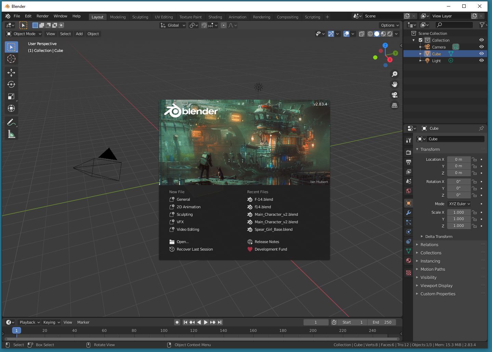

2 file -> import -> wavefront OBJ -> select out.obj
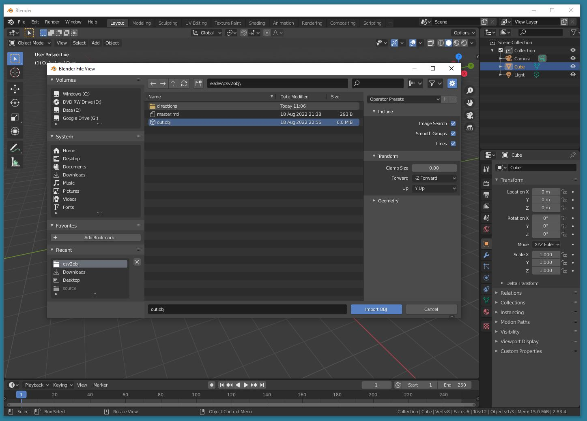

3 (optional) move the imported model to the center of the scene
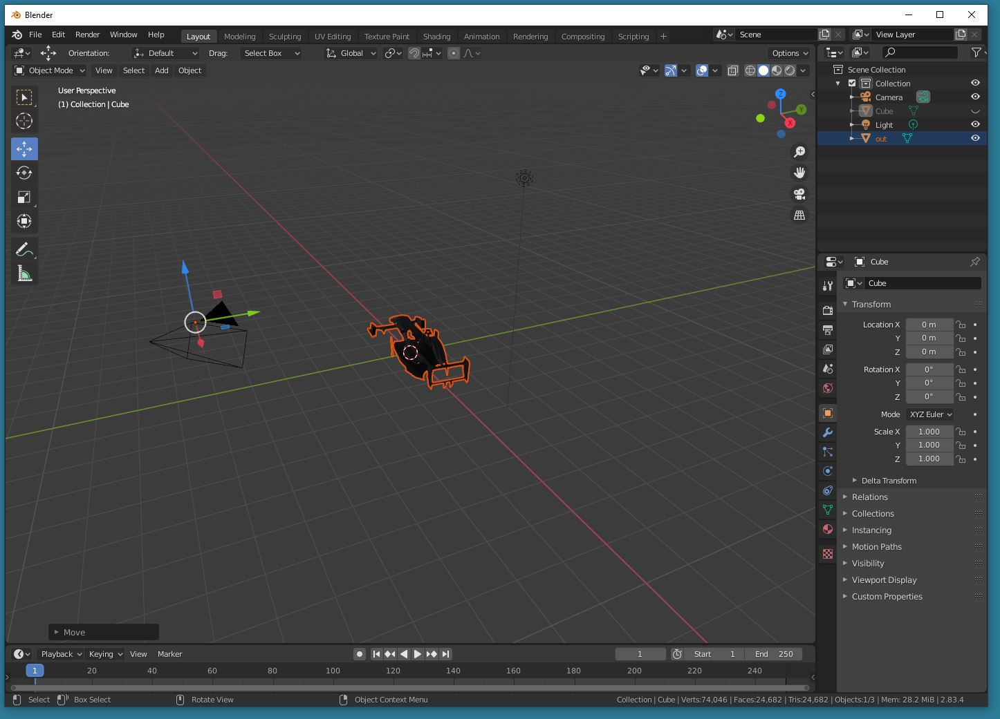

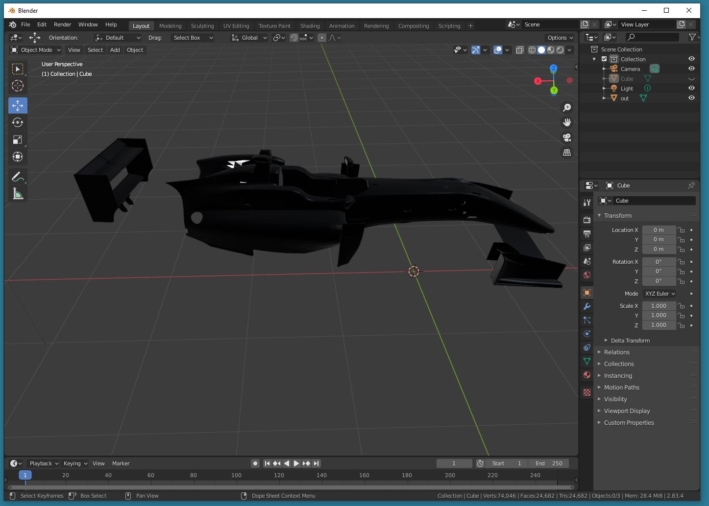

4 click on "Texture Paint", make sure the car model is selected as well as "car.tga"
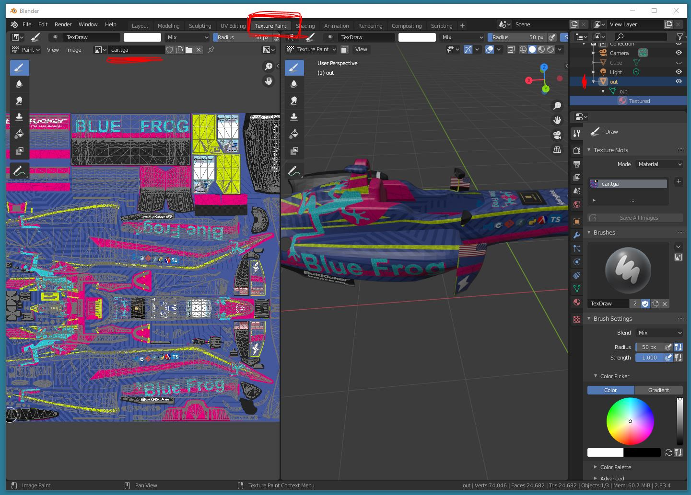

5 change the falloff to flat
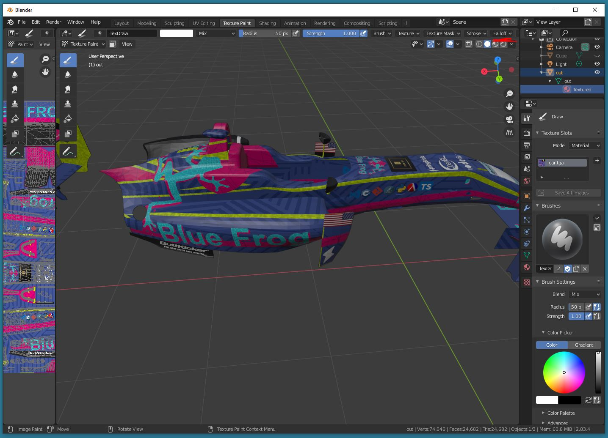

6 pick a color and adjust the pen radius 
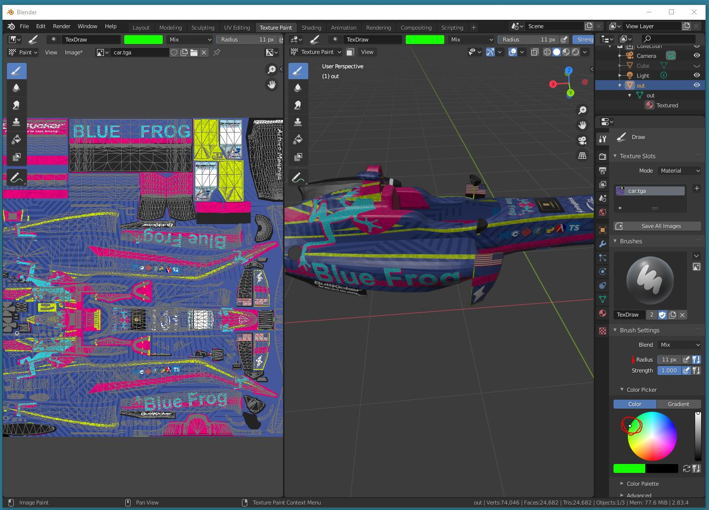

7 click and drag on the 3d model and notice how the texture updates across the seams
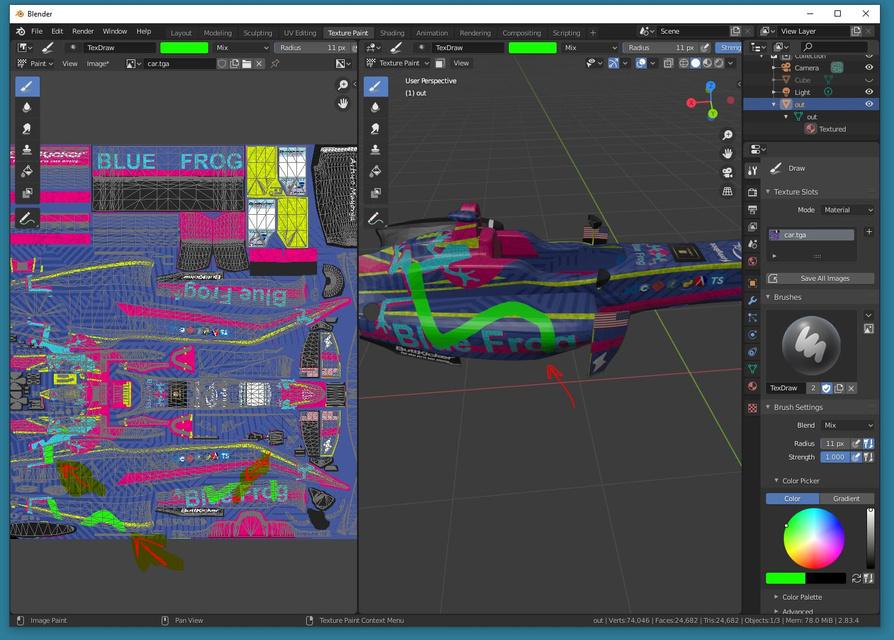

8 click on the texture brush tool, select "Brush Mask" and click on "New"
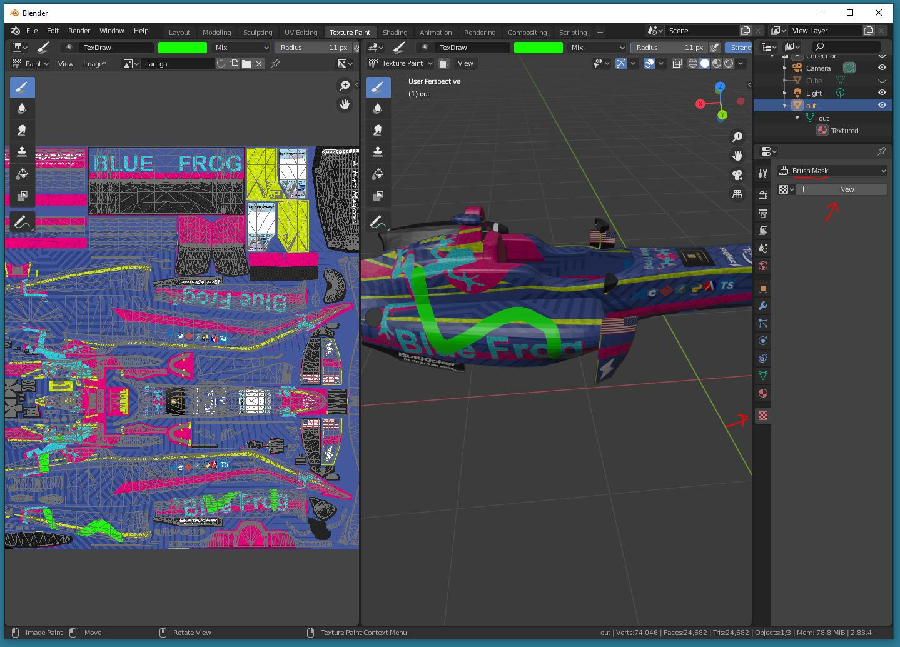

9 click open and find "lighbulbIcon.png"
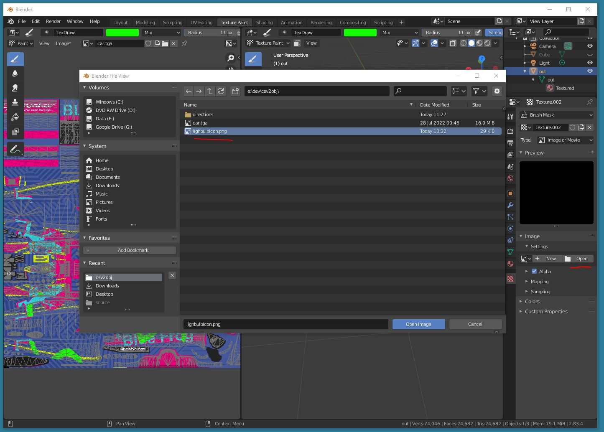

10 click on the car model to stamp the image onto the car and notice how it stamps across the seams
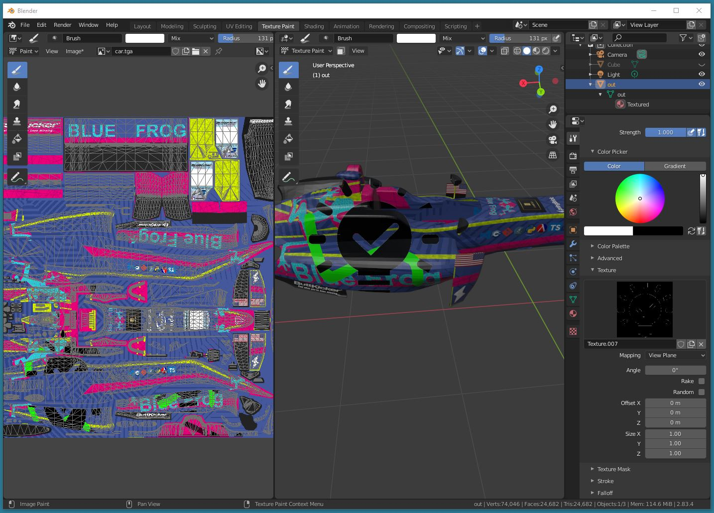

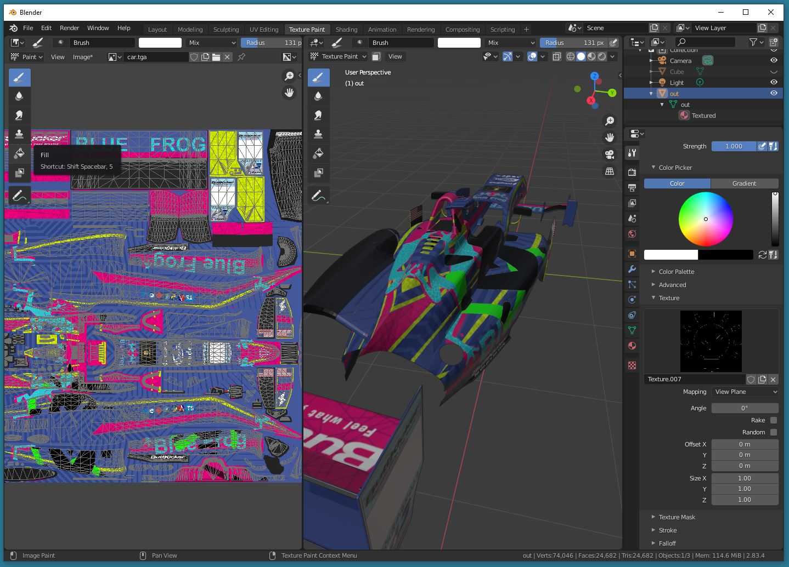